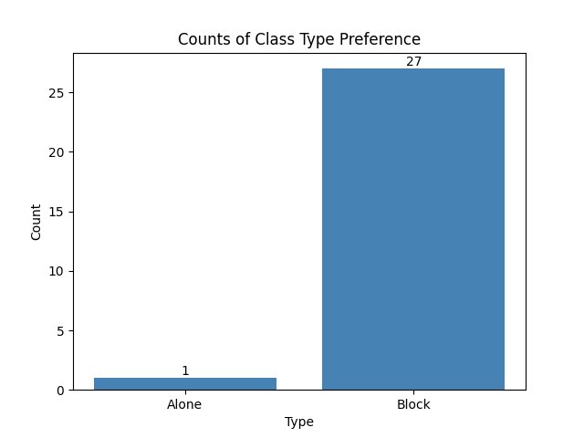
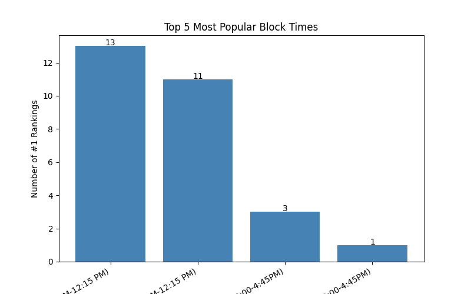

# BSDS Class Time Preferences

## Description
This data was collected through an anonymous survey sent out to all undergraduate data science students. The survey was sent out by the Undergraduate Data Science Council. We present this information to better inform the class time preference selection for future cohorts. 

Overall, data was collected from 28 undergraduate students. 13 of these students were second-years and 15 of these students were third-years. 

## Questions
### The survey asked three main question:
1. Do you prefer "blocks" of classes (e.g. two classes from 9:30 AM-12:15 PM) or stand alone classes (e.g. one class from 3:30-4:45 PM)
2. Please rank which block class times you prefer
3. Please rank which stand alone class times you prefer?
The results to the questions are presented below

## Results
Overall, students preferred the block class schedule compared to stand alone classes. 

Under the umbrella of block classes, students preferred to have blocks in the morning compared to the afternoon. Tuesday/Thursday and Monday/Wednesday had similar times. 

Under the umbrella of stand alone classes, students preferred to have morning classes that occur twice a week (1.25 hour sessions). This is in comparison to afternoon classes and ones that occur three times a week (50 minute sessions). 
